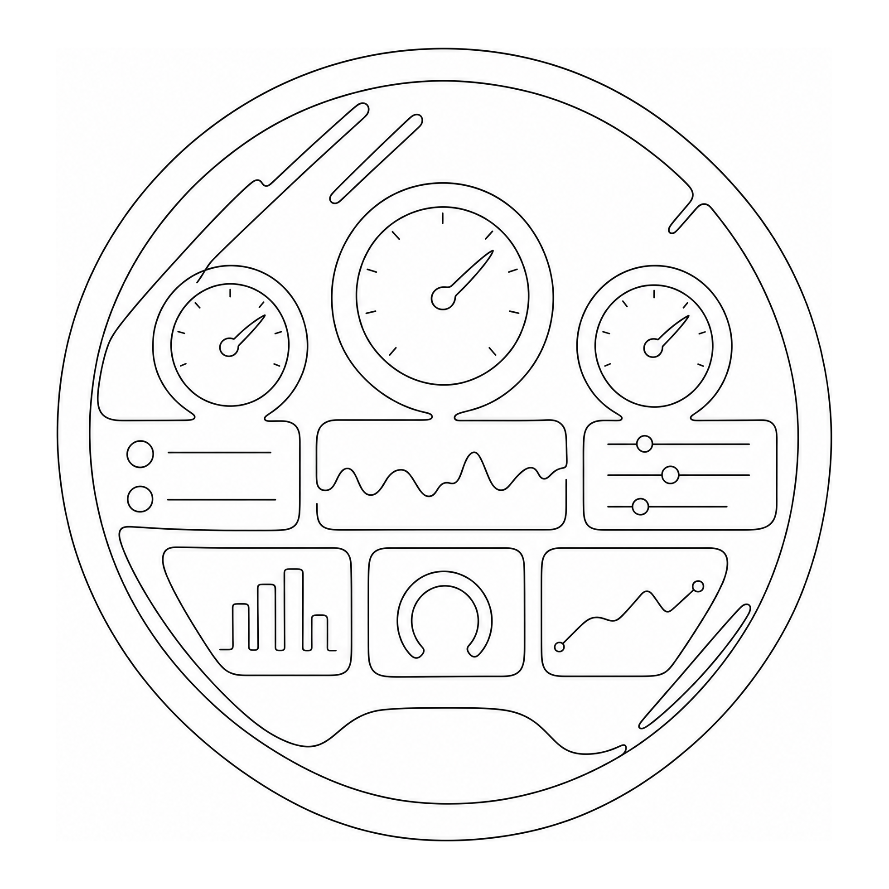

<p align="center">
  
</p>

# Dashbort

A single pane of glass for your life. Dashbort is a personal dashboard application that aggregates key life metrics, timers, and information into a single, always-visible interface.

## Overview

Dashbort provides a unified dashboard that consolidates essential information and tools in one place, eliminating context switching and providing immediate access to the most important information about your day.

## Features

Dashbort consists of modular widgets called **bortlets** that can be added to your dashboard:

- **Work Timer**: Countdown timer showing hours until work is over (customizable duration)
- **Pushup Counter**: Track daily pushup exercises with increment/decrement controls
- **Sunrise/Sunset**: Display sunrise and sunset times for your location
- **Recurring Daily Actions**: Track and manage recurring daily tasks

## Tech Stack

- **Framework**: Next.js (App Router)
- **Styling**: Tailwind CSS
- **Backend**: Firebase (Firestore, Authentication, Storage, Functions)
- **Language**: TypeScript
- **UI Components**: shadcn/ui

## Getting Started

### Prerequisites

- Node.js 18+ 
- npm, yarn, pnpm, or bun
- Firebase project with Firestore, Authentication enabled

### Installation

1. Clone the repository:
```bash
git clone <repository-url>
cd dashbort
```

2. Install dependencies:
```bash
npm install
# or
yarn install
# or
pnpm install
```

3. Set up environment variables:
   - Create a `.env.local` file in the root directory
   - Add your Firebase configuration:
   ```
   NEXT_PUBLIC_FIREBASE_API_KEY=your_api_key
   NEXT_PUBLIC_FIREBASE_AUTH_DOMAIN=your_auth_domain
   NEXT_PUBLIC_FIREBASE_PROJECT_ID=your_project_id
   NEXT_PUBLIC_FIREBASE_STORAGE_BUCKET=your_storage_bucket
   NEXT_PUBLIC_FIREBASE_MESSAGING_SENDER_ID=your_sender_id
   NEXT_PUBLIC_FIREBASE_APP_ID=your_app_id
   ```

4. Run the development server:
```bash
npm run dev
# or
yarn dev
# or
pnpm dev
# or
bun dev
```

5. Open [http://localhost:3000](http://localhost:3000) in your browser

## Project Structure

```
dashbort/
├── app/                    # Next.js App Router
│   ├── components/         # React components
│   │   ├── AuthWrapper.tsx
│   │   ├── Login.tsx
│   │   ├── RecurringDailyActions.tsx
│   │   ├── RepCounter.tsx
│   │   ├── SunriseSunset.tsx
│   │   └── WorkTimer.tsx
│   ├── layout.tsx          # Root layout
│   └── page.tsx            # Main dashboard page
├── components/             # Shared UI components
│   └── ui/                 # shadcn/ui components
├── lib/                    # Utilities and configurations
│   ├── firebase/           # Firebase configuration and utilities
│   └── utils.ts            # Helper functions
└── public/                 # Static assets
```

## Bortlets

Bortlets are the modular, pluggable widgets that make up your Dashbort dashboard. Each bortlet is a self-contained component that can be dynamically loaded, configured, and arranged by the user.

**Available Bortlets:**
- **Work Timer** (`workTimer`): Countdown timer showing hours until work ends
- **Rep Counter** (`repCounter`): Track daily exercise repetitions with multiple exercise types
- **Sunrise/Sunset** (`sunriseSunset`): Display sunrise and sunset times for your location
- **Recurring Daily Actions** (`recurringDailyActions`): Track completion of recurring daily tasks
- **Days Until Payday** (`daysUntilPayday`): Countdown to next payday (compact 1x1)
- **Date/Time** (`dateTime`): Real-time date and time display (compact 1x1)
- **Google Calendar** (`googleCalendar`): Display upcoming Google Calendar events (requires OAuth)
- **Workout History** (`workoutHistory`): Visual heatmap of workout history from Rep Counter

For detailed documentation on bortlets, including how to add new ones, see [README_BORTLETS.md](./README_BORTLETS.md).

## Development

### Adding a New Bortlet

See [README_BORTLETS.md](./README_BORTLETS.md) for comprehensive documentation. Quick steps:

1. Create a new component in `app/components/bortlet/`
2. Implement the `BortletProps` interface
3. Register it in `lib/bortlets/registry.ts` (single source of truth)
4. Add import to `lib/bortlets/loader.tsx`
5. Types are automatically generated from the registry!

Use Firebase hooks from `react-firebase-hooks` for data operations, and shared components from `lib/bortlets/components.tsx` for consistent UI.

### Code Style

- Use TypeScript for all files
- Prefer Server Components by default
- Use Client Components only when necessary (interactivity, hooks, browser APIs)
- Use `react-firebase-hooks` for all Firebase client-side operations
- Follow Next.js 13+ App Router conventions
- Use Tailwind CSS for styling

## Firebase Setup

1. Create a Firebase project at [Firebase Console](https://console.firebase.google.com/)
2. Enable Firestore Database
3. Enable Authentication (Email/Password)
4. Copy your Firebase config to `.env.local`
5. Deploy Firestore rules and indexes:
```bash
firebase deploy --only firestore:rules,firestore:indexes
```

## Learn More

- [Next.js Documentation](https://nextjs.org/docs)
- [Firebase Documentation](https://firebase.google.com/docs)
- [Tailwind CSS Documentation](https://tailwindcss.com/docs)
- [react-firebase-hooks Documentation](https://github.com/CSFrequency/react-firebase-hooks)

## Deploy

The easiest way to deploy Dashbort is using [Vercel](https://vercel.com):

1. Push your code to GitHub
2. Import your repository in Vercel
3. Add your Firebase environment variables
4. Deploy!

For more details, see the [Next.js deployment documentation](https://nextjs.org/docs/app/building-your-application/deploying).
